# Streamly

Streamly is a minimal YouTube-style Android app with long-form HLS videos, vertical HLS shorts,
offline downloads, and a profile with sign-out. It is built with Kotlin Multiplatform and Compose
Multiplatform, with an Android target only.

> **Status: 1.0, the submitted build.** All seven reference views are done: onboarding, the home feed, Shorts, the player,
> Downloads, Profile, and the sign-out confirmation. Returning users go straight to Home, which loads the video catalog with category
> chips, an adaptive grid, and loading, empty, and error states. Tapping a video plays it over HLS
> with Media3: play/pause, scrubbing, mute, a buffering indicator, a LIVE badge for live streams,
> playback errors with retry, and an up-next list. A bottom bar (a rail on wide windows) switches
> between Home, Shorts, Downloads, and Profile. Shorts is a full-screen vertical pager of HLS shorts that
> autoplays only the visible one from a pool of at most two players. The player's Download action
> saves a video with Media3's `DownloadManager`, with real progress in the player, the Downloads
> tab, and a notification; finished downloads play with the network off and can be removed.
> Downloads belong to the account that saved them: signing out hides them, and signing in again
> as the same account brings them back. Profile shows the account and signs out after a
> confirmation, returning to onboarding. Watch history lists what each account has watched, with
> its progress, and the player resumes a video where that account left off. Settings chooses the
> theme (system, light, or dark), Wi-Fi-only downloads, and the download quality. The app has its
> own launcher icon, a branded splash that stays until the stored session and settings are read,
> and the mockups' typeface, Baloo Da 2.

## Demo

[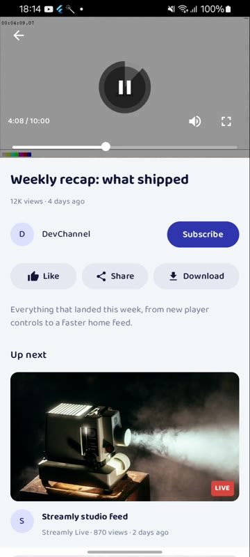](docs/media/streamly-demo.mp4)

**[Watch the demo (3 min 35 s, silent MP4)](docs/media/streamly-demo.mp4).** It was recorded on a
Samsung Galaxy A04 (Android 14) from the benchmark APK below.

| Time | What it shows |
| --- | --- |
| 0:00 | Splash, onboarding (Google, email, guest), email sign-in |
| 0:12 | Home feed: loading placeholders, scrolling, category chips |
| 0:27 | Player: HLS playback, scrubbing, mute, pause and play |
| 1:00 | Fullscreen in landscape, then Up next into a live stream (LIVE badge, no Download) |
| 1:22 | A real download with progress in the Player and the Downloads tab (the wait is trimmed) |
| 1:44 | Shorts: a vertical pager in which only the visible short plays |
| 2:07 | Offline: Wi-Fi off, the download plays, an unsaved video fails with Try again; Wi-Fi back, retry |
| 2:51 | Removing the download, with a confirmation |
| 2:56 | Watch history and resume, the dark theme, sign-out with a confirmation |

## Screenshots

Phone (Galaxy A04, benchmark build):

| Onboarding | Home | Shorts | Player | Downloads |
| --- | --- | --- | --- | --- |
| 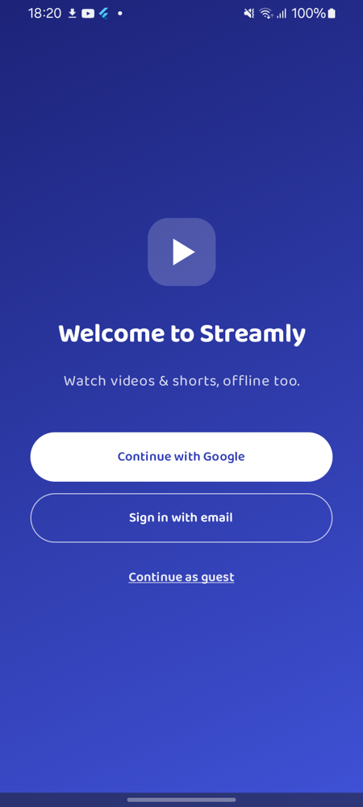 | 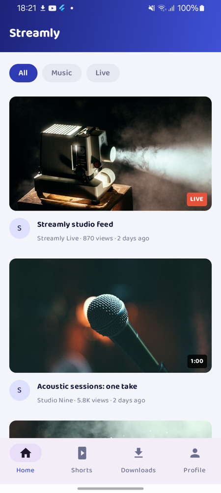 | 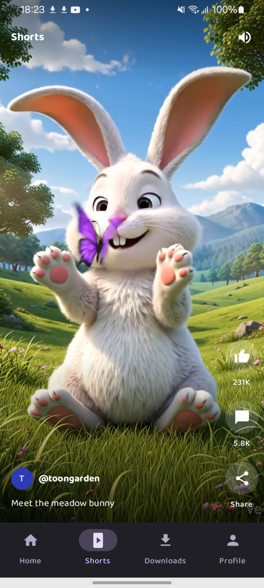 | 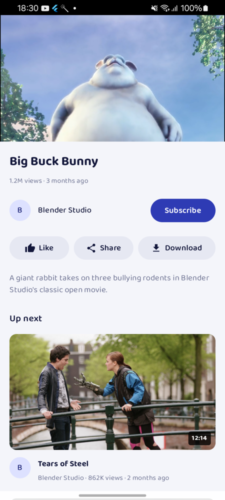 | 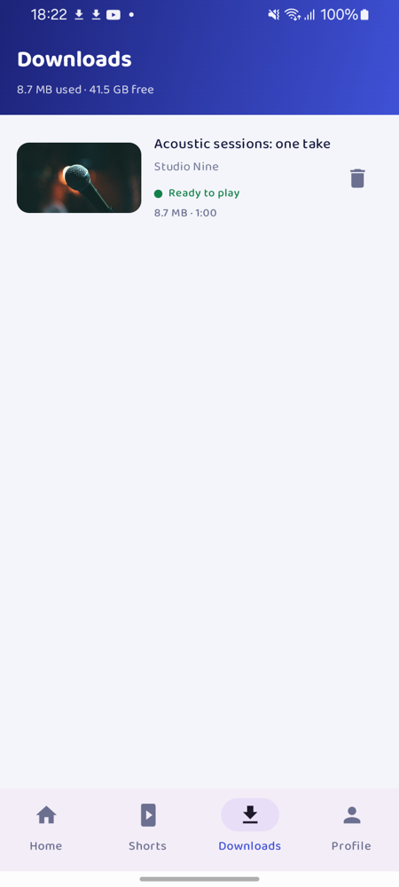 |

| Profile | Sign out | Settings | Home, dark | Watch history |
| --- | --- | --- | --- | --- |
| 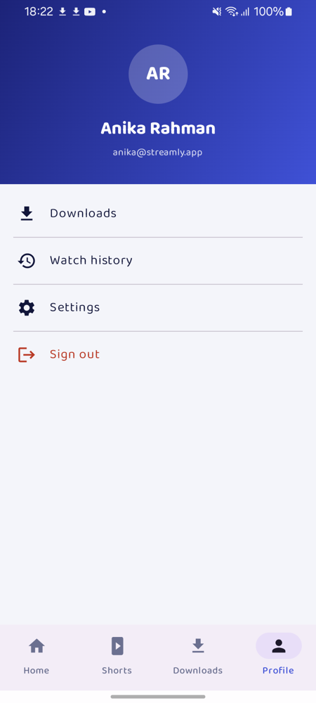 | 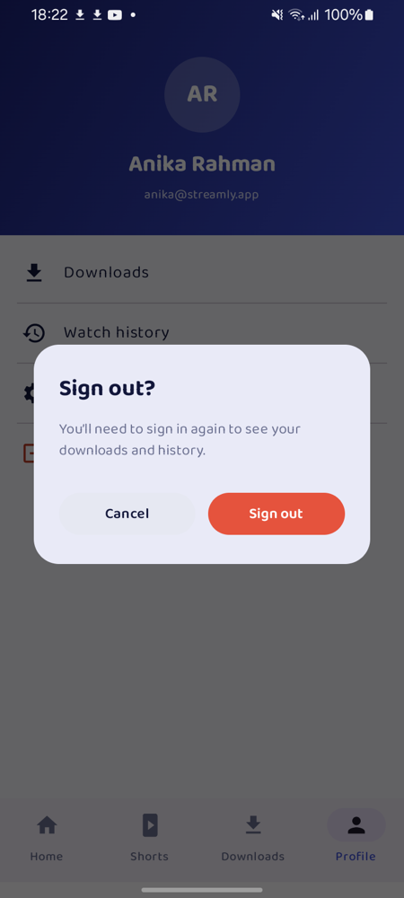 | 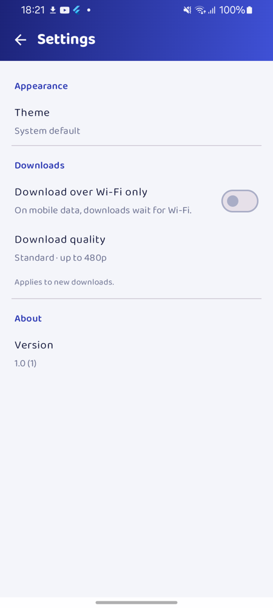 | 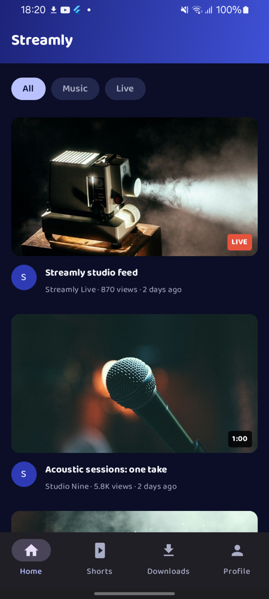 | 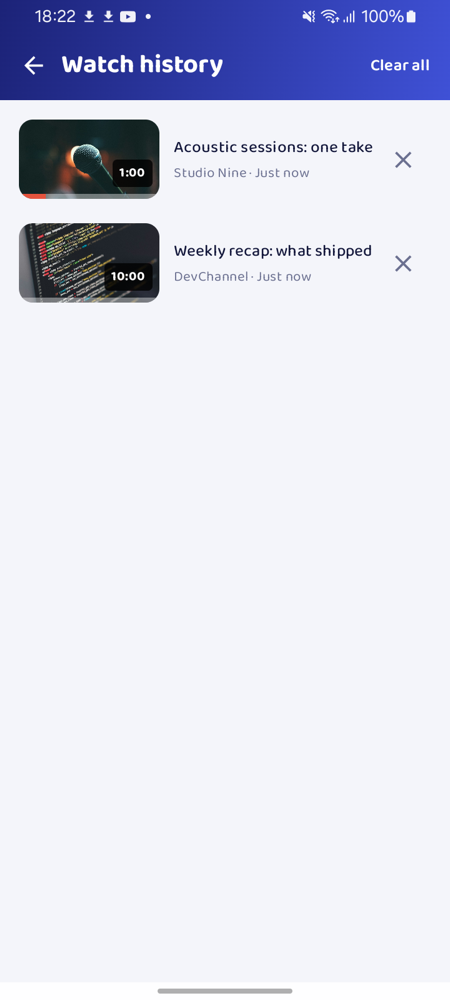 |

Tablet (a 1200x900 dp window) and phone landscape (emulator, benchmark build):

| Tablet home | Tablet player |
| --- | --- |
| 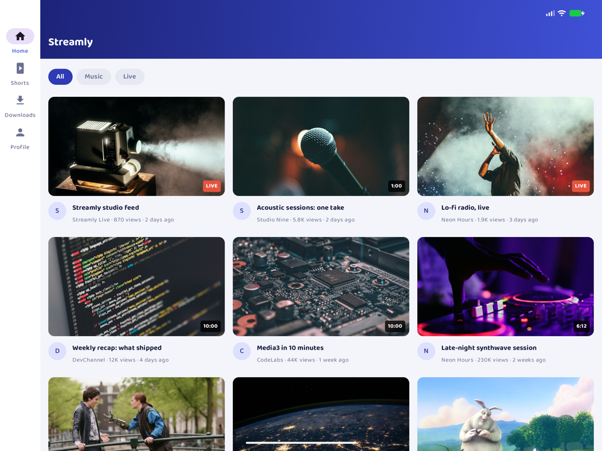 | 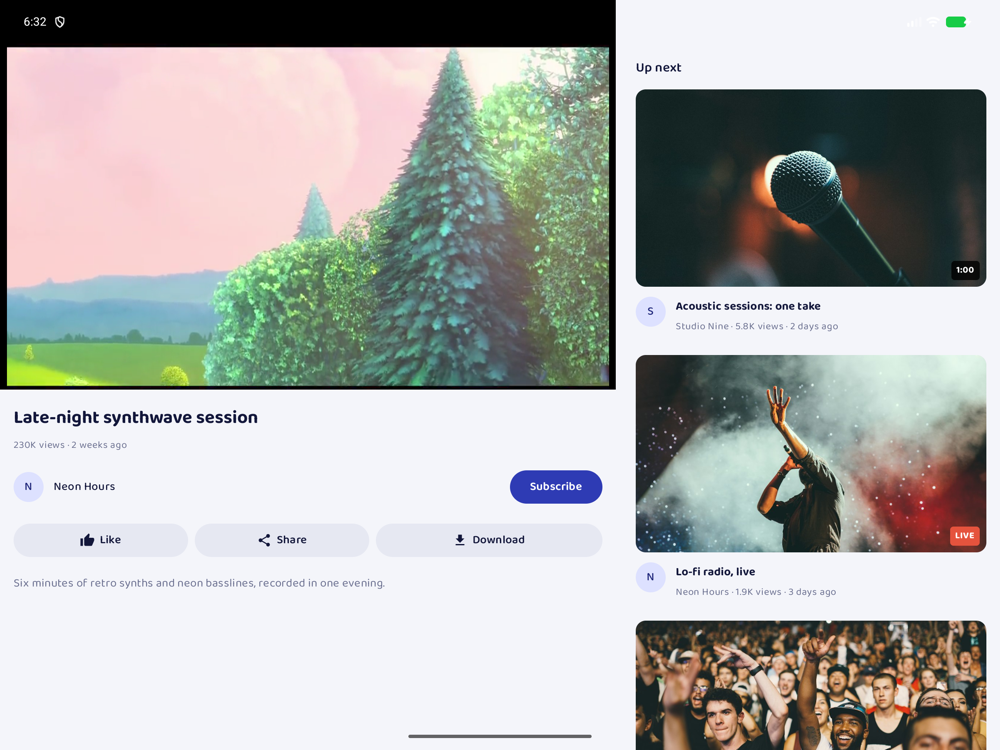 |

| Landscape home | Landscape player |
| --- | --- |
| 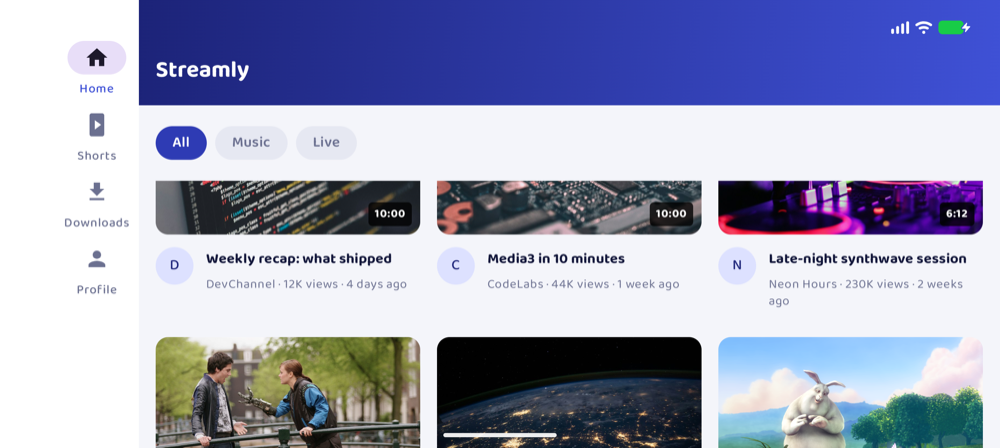 |  |

## Install the APK

[`apk/streamly-1.0-benchmark.apk`](apk/streamly-1.0-benchmark.apk) (3.4 MB) is the build to try,
on Android 7.0 (API 24) or newer. It is the release build minified with R8 and signed with a debug
key, so it installs without a store and runs without debug overhead.

- **On a phone:** download the file, open it, and allow installing apps from that source when
  Android asks.
- **With adb:** `adb install apk/streamly-1.0-benchmark.apk`

Because it is debug-signed, it cannot update a Streamly build signed on another machine. Uninstall
that build first: `adb uninstall com.shafayatb.streamly`.

## Build from source

**Requirements**

- Android Studio with the Android SDK for API 37 (`compileSdk`/`targetSdk` 37, `minSdk` 24).
- JDK 17 or newer to start Gradle. The Gradle daemon runs on JDK 21
  (`gradle/gradle-daemon-jvm.properties`); Gradle can provision it automatically.
- A device or emulator running Android 7.0 (API 24) or newer.

**Commands**

```bash
./gradlew :androidApp:assembleBenchmark # build the minified, debug-signed APK that ships
./gradlew :androidApp:assembleDebug     # build the debug APK
./gradlew :androidApp:installDebug      # install on a connected device or emulator
./gradlew check                         # lint and host tests for every module
./gradlew :shared:testAndroidHostTest   # host tests for one module (same task in each library)
./gradlew :shared:connectedAndroidDeviceTest   # Compose device tests (needs a device or emulator)
```

The APKs are written to `androidApp/build/outputs/apk/benchmark/androidApp-benchmark.apk` and
`androidApp/build/outputs/apk/debug/androidApp-debug.apk`.

**Build types.** `debug` is debuggable and writes the player event logs used in testing
(`StreamlyPlayer` and `StreamlyShorts`, gated on `FLAG_DEBUGGABLE`). The two `StreamlyDownloads`
lines, which rendition is queued and when a saved copy plays, are written by every build.
`benchmark` copies `release`, then enables R8 code and resource shrinking, turns debugging off,
and signs with the debug key. It needed no keep rules beyond the libraries' own consumer rules,
and its end-to-end pass covered every screen and every persisted store after a restart. `release`
is unchanged and unsigned; publishing would need a real signing configuration.

## Architecture

The app follows clean architecture with MVVM + MVI presentation: each screen has one `ViewModel`
that exposes an immutable `UiState` as a `StateFlow` and accepts a sealed intent type.

### Module graph


| Module | Responsibility |
|---|---|
| `:androidApp` | Thin Android shell: `MainActivity`, `StreamlyApplication`, and the composition root that starts Koin. |
| `:shared` | Compose UI: navigation (Nav3), screen ViewModels, feature screens, and resources. |
| `:domain` | Pure Kotlin models, repository and player contracts, and use cases. Its only dependency is `kotlinx-coroutines-core`. |
| `:data` | Implements the network and storage contracts: Ktor clients, DTOs and mappers, and DataStore storage for the session, download owners, watch history, and settings. |
| `:core:designsystem` | Theme and reusable Compose components. |
| `:core:media` | All Media3 code: the shared normal-video player, the Shorts player pool, `DownloadManager`, and the single download cache that offline playback also reads from. It exposes Compose video surfaces to `:shared/androidMain`. |

Dependency rules:

- `:domain` depends on no other module and has no Android, Compose, Ktor, DataStore, Media3, or
  Koin imports.
- Media3 types stay inside `:core:media`. Common UI works with domain state and identifiers, never
  with a Media3 `Player`.
- `:core:media` owns both playback and downloads, so playback and `DownloadManager` share one
  cache. Separate caches would break offline playback.
- Library modules use Kotlin explicit API mode, so every public declaration is a deliberate choice.

### Normal-video playback

One `ExoPlayer` plays every long-form video. The domain declares a framework-free contract,
`VideoPlayer` (`load`, `play`, `pause`, `seekTo`, `setMuted`, `retry`, `stop`), which exposes a
`StateFlow<PlaybackState>`. `:core:media` implements it as `ExoVideoPlayer`, so no Media3 type
reaches the domain or common UI.

**Ownership.** Koin creates `ExoVideoPlayer` as an application singleton in `mediaModule`.
The ViewModel and the composition never own the player, so a rotation cannot recreate it. Every
player screen reuses the same instance, whether the video was opened from Home or from up next.
The `ExoPlayer` inside is built on first use and released only when Koin closes (`onClose`).
It holds the application context only. `stop()` also detaches the video surface: media3-ui-compose
detaches its `SurfaceView` only while the screen is still composed, so a popped player screen left
its surface on this app-wide player, and the next rotation leaked the destroyed `Activity` through
it. A heap dump analysed with LeakCanary's `shark-cli` showed the path.

**Lifecycle.** `PlayerViewModel` drives the player through intents. The screen reports
visibility with `ScreenShown` and `ScreenHidden`:

| What happens | Result |
|---|---|
| The app goes to the background | The video pauses. On return it resumes only if it was playing and the player screen is still showing. A video that finishes loading in the background waits until the screen is shown. |
| Rotation, or a dark-mode switch | Nothing. The screen ignores stop events while the activity is changing configuration. Only the video surface detaches and reattaches; playback continues without rebuffering. |
| The fullscreen button on a phone | The same as a rotation: the requested orientation recreates the activity once, and playback continues (surface gap 0.2–0.7 s on the test devices, position continuous). |
| Back, or the on-screen back arrow | Nav3 drops the popped entry's lifecycle to `CREATED` at once, so audio pauses before the exit animation (about 40–110 ms on the test devices). When the entry's ViewModel clears, it calls `stop()`, which unloads the video, frees the decoders, and detaches the surface. The player instance stays. |
| Up next | The current video stops at once, and the new route replaces the old one, so Back returns to Home. |
| Another screen covers the player (no such destination exists yet) | The video pauses, and resumes if the player screen returns. |

The shared player outlives each screen, so a screen controls it only while its own video is
loaded (`PlaybackState.videoId`). A screen that is being replaced can therefore never pause or
stop the video that replaced it. `VideoSurface` follows the same rule: it attaches only while the
player holds its video, and it keeps the screen on only while that video plays.

**HLS and ABR.** Every catalog item is HLS, played through `HlsMediaSource`. The default track
selector and bandwidth meter handle adaptive bitrate. Debug builds attach Media3's
`EventLogger` under the logcat tag `StreamlyPlayer`, so track switches are visible:
`adb logcat -s StreamlyPlayer | grep videoInputFormat`.

**One cache.** `MediaCache` owns the app's only `SimpleCache` (`StandaloneDatabaseProvider`,
`NoOpCacheEvictor`). Playback reads through a `CacheDataSource` over it, and `DownloadManager`
writes into the same cache, so downloaded videos play offline (see [Offline downloads](#offline-downloads)).
Playback reads but does not write, because a cache that never evicts would otherwise grow with
everything streamed.

**Adaptive layout.** A phone in portrait shows the 16:9 player above the details and up next.
At expanded widths, up next moves to a side column. A short window, such as a phone in landscape,
shows the video full screen in immersive mode.

**Fullscreen.** A toggle next to mute switches fullscreen on and off. Back, or the overlay's
arrow, leaves fullscreen before it leaves the screen.

- **On a phone, like YouTube:** the button locks landscape. The lock lasts only until the phone
  is held sideways; then the sensor takes over again, so turning the phone upright exits.
  Exiting in landscape locks portrait the same way. With auto-rotate off, the lock lasts until
  the user exits or leaves the Player. The orientation is given back as soon as the Player is no
  longer on top (`OrientationReleaseEffect` in `AppNavigation`), not when its exit animation ends.
- **On a tablet, an unfolded foldable, or a split-screen window:** the button only hides the
  system bars. Android 16+ ignores orientation requests on large screens, and every version
  ignores them in multi-window.
- **The rule:** a pure function in `Fullscreen.kt`, covered by host tests. The ViewModel keeps the
  state, so it survives the activity recreation the rotation causes. The Android side only applies
  `requestedOrientation` and runs an `OrientationEventListener` while a lock is held.
- **No layout switch mid-rotation:** the layout waits for a requested rotation to land.
  Switching first rebuilt the video surface mid-rotation, and the system held the rotation until
  it drew, which showed about 1.8 s of black on the emulator.

### Shorts and the player pool

Shorts play from their own pool, separate from the long-form player. The domain declares the
contract, `ShortsPlayerPool`, with no Media3 types. `acquire()` returns a `ShortsPlayerLease`:
`show(visible, upcoming, playWhenReady)`, `play`, `pause`, `setMuted`, `retry`, and `close`. It
exposes a `StateFlow<ShortsPoolState>` holding the visible short's id, the `PlaybackState` of each
short that has a player, and the shared mute.

**Policy: at most two players.**

| Page | Player |
|---|---|
| Visible | Plays, looping (`REPEAT_MODE_ONE`). |
| The next page | Prepared and paused at its start, so a swipe forward starts at once and its first frame is already on screen. |
| Every other page | None. |

Only a *settled* page drives the pool, so a fling across several pages loads none of the pages it
passes. Players are recycled, not created: when the window moves, a player that already holds
the visible or next short keeps it (swiping forward plays the prepared player; swiping back keeps
the short you came from as the paused, rewound neighbour). A player whose short leaves the window
loads the newly needed one. On the last page the spare player is stopped, which frees its
decoders. The short that was playing is paused before another starts, and each player takes
audio focus when it plays, so two shorts, or a short and a long-form video, never sound together.

The policy lives in `SlotPool`, which is independent of Media3 and is covered by host tests with
fake slots: never more than two players, the visible one plays, the next one is prepared, far
pages hold none, recycling across fast swipes and jumps, never two playing at once, shared mute,
and release. `ExoShortsPlayerPool` backs each slot with an `ExoPlayer` built by the same factory
as the long-form player (HLS through the one `MediaCache` data source, audio focus, becoming-noisy).

**Scope.** The pool object is an application singleton in `mediaModule`, like the cache it reads
through, so only one pool can ever hold players and the composition never owns one. Its players
are screen-scoped. `ShortsViewModel` acquires the lease when it is created; the pool builds the
two `ExoPlayer`s on the first settled page and releases them when the ViewModel clears and closes
the lease. A lease that has been replaced is ignored, so a Shorts screen that is still leaving
can never pause or release the players of a newer one. Debug builds log pool events under the
logcat tag `StreamlyShorts`, including `Created pool player <id>` next to Media3's
`ExoPlayerImpl … Init <id>`.

**Lifecycle.** The Shorts screen reuses the player screen's `ScreenVisibilityEffect`:

| What happens | Result |
|---|---|
| The app goes to the background | The visible short pauses, and resumes on return only if it was playing. A short the user paused stays paused. |
| Rotation, or a dark-mode switch | Nothing. Only the surfaces detach and reattach; no player is created, paused, or reloaded. |
| Back, or the Home tab | The short pauses at once (Nav3 drops the popped entry to `CREATED`), and both players are released when the entry's ViewModel clears, about 0.8 s later, after the exit animation. |
| A tap on the video | Pause or resume, with a play indicator while paused. Taps are ignored while the short shows a playback error, so a stray tap cannot leave it paused once "Try again" recovers it. |

`ShortSurface` follows the long-form surface's rule: it attaches only while a pool player holds
its short, so a page whose player was recycled never shows another short's picture. Phones fill
the screen with the short (cropped). Medium and wider windows show it at 9:16, centered with black
bars, with the like, comment, and share actions beside it rather than over it.

### Offline downloads

Downloads use Media3's offline module. The domain declares `DownloadRepository` (`downloads`,
`storage`, `download(video)`, `retry`, `remove`) with a framework-free `VideoDownload` model
(`QUEUED`, `WAITING_FOR_NETWORK`, `WAITING_FOR_WIFI`, `DOWNLOADING`, `COMPLETED`, `FAILED`,
`REMOVING`, percent, and bytes). `:core:media` implements it as `MediaDownloads`, an application singleton.

**One cache, one database.** `MediaDownloads` owns the app's only `DownloadManager`. It writes into
`MediaCache`'s `SimpleCache`, shares its `StandaloneDatabaseProvider` (the download index and the
cache index live in the same database), and fetches through the same `DefaultHttpDataSource`
factory as playback. Nothing else creates a cache or database.

**Rendition.** `DownloadHelper` reads the master playlist and picks the best variant at or below
the size cap of the [download quality setting](#settings), plus its audio: 640x360 (Data saver),
854x480 (Standard, the default), or 1280x720 (High). At Standard a 10.5-minute video is about
70 MB instead of about 490 MB at 1080p, and a stream without such a variant falls back to its
lowest one. The quality is read when each download is prepared, so a change applies to new
downloads only; a download in progress, and Retry of a failed one, keep the stream keys they
started with. Every build logs `StreamlyDownloads: Queuing <id> at <quality>: [<width>x<height>]`. Live streams cannot be downloaded,
so the player hides the action for them. The video's title, channel, thumbnail URL, and length are
stored as JSON in `DownloadRequest.data`, so the Downloads tab lists them offline without the catalog.

**Offline playback through the normal player.** The cache alone is not enough: with the network
off, `HlsMediaSource` would pick a variant from its bandwidth estimate, usually one that was never
downloaded. So when `ExoVideoPlayer` loads a video that has a *completed* download, it plays
`DownloadRequest.toMediaItem()`, whose stream keys restrict the playlist to the saved rendition.
Everything else, including partly downloaded videos, streams with full ABR as before. The check
lives inside `:core:media`, so stream keys never reach the domain or the UI. Every build logs
`StreamlyDownloads: Playing download <id> (<n> stream keys)` when this happens.

**Progress.** `DownloadManager` reports state changes through its listener but not progress, so
`MediaDownloads` polls `getCurrentDownloads()` every 500 ms while anything is downloading and stops
when nothing is. Completed and failed downloads are not in `getCurrentDownloads()`, so it reads
the download index once at start (off the main thread) and applies listener events on top. The
progress mapping is host-tested (`DownloadMappingTest`, `DownloadMetadataTest`).

**Service and notifications.** `StreamlyDownloadService` is Media3's `DownloadService` running as a
`dataSync` foreground service (`FOREGROUND_SERVICE_DATA_SYNC` for Android 14+), so downloads
continue in the background. Its notification shows the title and percent, and a separate
notification reports "Download completed" or "Download failed". On Android 13+ the first tap on
Download asks for notification permission; the download runs whatever the answer, because only
the notification needs it. `MainActivity` starts the service at launch, so downloads left
unfinished by a killed process resume.

**Network policy.** By default downloads may use any network (`Requirements.NETWORK`). Settings'
"Download over Wi-Fi only" switches the `DownloadManager` to `Requirements.NETWORK_UNMETERED`; the
change applies at once, so a download running on mobile data pauses (keeping what it saved) and
resumes on Wi-Fi. The status names the wait: "Waiting for network" when offline, "Waiting for
Wi-Fi" when only a metered network is available (Media3 reports the unmet unmetered requirement).
At launch the stored choice is not known yet, and Media3's `DownloadService` resumes the manager
as soon as it starts, so `MediaDownloads` begins with the strict Wi-Fi requirement and applies the
stored one when the settings DataStore answers: a Wi-Fi-only user never spends mobile data, and
the downloads flow waits for that answer so nobody sees a false "Waiting for Wi-Fi".
`getScheduler()` returns `null`: Media3 never uses a scheduler on Android 12+, and doing the same
on older versions avoids a job service and the boot permission for a path the test devices
cannot exercise. While the app is open, a waiting download starts by itself when the network (or
Wi-Fi) returns. Android 12+ does not let the app start its download service from the background,
and there is no scheduler, so a download still waiting when the app is closed starts the next time
the app is opened with a suitable network. The notification ("Downloads waiting for WiFi" while a
paused download waits) shows only while a download has started in this process. If the settings
cannot be read, downloads fail safe to Wi-Fi only and the read is retried.

**UI.** The Player's Download action shows the real percent in a progress ring; tapping it while
queued or downloading cancels the download. While a download waits it reads "Waiting" (the only
word that fits beside Like and Share on a 360 dp phone); TalkBack hears "Waiting for Wi-Fi" when
that is the reason. "Downloaded" asks before removing, and "Retry"
restarts a failed download. The Downloads tab (mockup 05) shows the storage used and free space,
unfinished and failed downloads first (with a progress bar, "Waiting for network", "Waiting for
Wi-Fi", or Retry), then
finished ones marked "Ready to play". Rows can be cancelled or removed (with a confirmation
dialog; the dialog closes, and stays closed, if its download disappears), and tapping a finished
one opens the player. Removing a download takes it out of the
account's list at once; its files are deleted when no other account still has it saved (see
below), so the storage figure drops and the video no longer plays offline for that account.

**Downloads per account.** Downloads belong to the account that saved them, like YouTube's:
signing out hides them, and signing in again as the same account shows them. A video's files are
still saved once on the device, so the design keeps two layers:

- `DeviceDownloads` (`MediaDownloads`) is every download on the device, whoever saved it.
- `DownloadOwnershipRepository` (`:data`, its own DataStore file) records which accounts saved each
  video. The account key is `email:<address>` for a signed-in account and `guest` for a guest.
- `AccountDownloadRepository` (pure Kotlin in `:domain`, fully host-tested) combines the session,
  the owners, and the device downloads into the `DownloadRepository` the screens already used, so
  the Player and Downloads ViewModels did not change.

The rules: an account sees only its own downloads and its own storage figure. Downloading a video
another account already saved adds an owner and reuses the files, with no second download. Removing
it drops only that account; the files are deleted when the last owner removes them, because two
accounts' downloads share the same cached segments. The player plays a saved copy only for an
account that owns it and streams for anyone else. Until the owners have been read (a player
restored at launch), it trusts the saved copy, so an owner's offline playback never fails on a
race. Downloads that existed before this change are adopted by the first account that sees them.
Once per launch, owner records whose download no longer exists (for example, a video downloaded
again before Media3 finished removing it) are dropped, unless a download has already started in
that run, because a new download's owner is recorded before the device lists it. A removal reports
whether its owner change was saved: if it was not, the files stay and the screen shows "Couldn’t
remove the download. Please try again."

Ownership is not stored in `DownloadRequest.data`: Media3's `DownloadManager.mergeRequest` moves an
existing download, even a completed one, back to the queue when its request is added again, so
changing owners there would re-download finished videos and break offline playback.

### Navigation shell

`AppShell` wraps the Nav3 `NavDisplay` with the tab chrome (Home, Shorts, Downloads, and Profile): a bottom `NavigationBar` on compact
and medium widths and a `NavigationRail` on expanded widths, shown only while a tab is on top.
The player and other pushed destinations take the whole window. `NavDisplay` stays at the same
place in the composition whether or not the chrome shows, so no back-stack state is lost.

Home is always the root of the back stack, and every other tab sits on top of it
(`selectTopLevel`). Back from Shorts and the Home tab therefore both pop Shorts, which is what
releases its players; returning to Shorts starts a fresh screen. A video opened from Downloads
plays on top of the Downloads tab, so Back returns there. Home's entry stays in the back
stack the whole time, so its ViewModel and its saved grid position survive switching tabs. The
chrome is dark while Shorts is selected, because Shorts always uses the dark color scheme.

### Profile and sign-out

Profile (mockup 06) is the fourth tab. `ProfileViewModel` reads `SessionRepository.session` and
shows the initials, name, and email under a brand header, then rows for Downloads (which selects
the Downloads tab), Watch history (which opens the history), Settings (which opens the settings),
and a red Sign out. In phone landscape the header
moves to a side panel; on wider windows the rows stay in a 640 dp column.

Sign out opens the confirmation (mockup 07): "Sign out?" with Cancel and a red Sign out. The
dialog lives in the ViewModel's state, so it survives rotation. Confirming clears the session and
replaces the whole back stack with Onboarding, so Back leaves the app and the next launch starts at
onboarding. A failed sign-out closes the dialog, shows a message, and leaves you signed in; a
second tap while signing out is ignored. Downloads are not deleted: they are hidden until their
account signs in again, and a download in progress keeps going in the background.

A guest sees a person icon, "Guest", and "Not signed in", and a primary "Sign in" row in place of
Sign out. It asks "Leave guest mode?" (guest downloads stay for the next time you continue as a
guest) and then opens onboarding.

### Watch history

Watch history is per account, like downloads: signing out hides it, signing in again as the same
account shows it, and a guest has its own. The player resumes a video where that account left
off.

**Rules** (`WatchHistoryEntry` in `:domain`, host-tested):

- A long-form video enters the history the first time it actually plays, not when the player
  opens, so a stream that fails to load is never listed. Shorts are not recorded.
- It resumes from the saved position if that is at least 5 s. In the last 10 s, or past 95% of
  the length, the video counts as finished and starts over, as in video apps.
- Live streams are listed (with a LIVE badge and no progress bar) but never resume, so they
  always join at the live edge.

**Recording.** `PlayerViewModel` already knows the moments that matter, so it saves the position
the first time the video plays, on pause, when the app goes to the background, when the video
ends, every 10 s of playback, and before it stops the player on Back or an up-next pick. A
crash or process death therefore loses at most about 10 s. A replaced player screen never
writes, by the same `PlaybackState.videoId` rule that keeps it from controlling the player. Only
the first play adds a video to the history; later saves only update its entry, so a video removed
while the player's last save is still on its way stays removed.

**Resume.** Before loading, `PlayerViewModel` reads the saved position and calls
`VideoPlayer.load(video, playWhenReady, startPosition)`. `ExoVideoPlayer` passes it to Media3's
`setMediaItem(item, startPositionMs)`, so the first frame drawn is already the resume point (no
0:00 flash and no extra seek), and a downloaded video resumes from its saved rendition offline.
Live keeps the default position, its live edge. Leaving the screen while the position is still
being read cancels the load, so nothing plays after the screen is gone.

**Storage.** `AccountWatchHistory` (`:domain`) resolves the account from the session and queues
writes, in order, on an application scope, so the save made as the player screen closes still
lands. `DataStoreWatchHistoryStore` (`:data`) keeps one JSON list per account in its own
`watch_history` DataStore file, newest first, at most 100 entries. Each entry stores the title,
channel, thumbnail URL, and length, so the history lists offline and after a video leaves the
catalog. A value that no longer decodes starts that account's history afresh.

**Screen.** Profile's Watch history row opens it (no tab bar; Back returns to Profile). Each row
shows the thumbnail with its length and a coral progress bar, the title, and the channel with
when it was last watched; tapping it opens the player, which resumes. The X removes a row at
once; "Clear all" asks first. Phones show a list, wider windows the feed's grid columns.

### Settings

Settings opens from Profile's Settings row as a pushed screen (no tab bar; Back returns to
Profile), for guests too. The settings are device-wide: the same for every account and kept
across sign-out. They are stored in a `settings` Preferences DataStore behind the domain's
`SettingsRepository`; a value this version does not recognize, or a file that cannot be read,
falls back to the defaults, so the app always starts.

- **Theme:** System default (the default), Light, or Dark. `AppViewModel` carries the mode in
  `AppState.Ready` with the start route, so the splash covers the read and a stored Dark never
  flashes light; a change re-themes every screen at once without touching the back stack.
  `SystemBarsEffect` matches the window background and the navigation bar's icons to the chosen
  theme rather than the system's. Shorts stays dark, and onboarding keeps its brand surface.
- **Download over Wi-Fi only:** off by default. See [Network policy](#offline-downloads).
- **Download quality:** Data saver (up to 360p), Standard (up to 480p, the default), or High (up
  to 720p), for new downloads only. On the emulator one 2:45 video saved at 480x270 (9.6 MB),
  768x432 (30 MB), and 1280x720 (99 MB).
- **About:** the app's version.

The download settings reach `:core:media` through a narrow `DownloadPreferencesSource` contract, so
the media layer cannot change settings and a theme change never reaches it. Theme and quality open
a radio dialog that applies the choice at once (Cancel changes nothing); the dialog survives
rotation. A failed save shows "Couldn’t save the setting" and the screen keeps showing the stored
value. Until the settings are read the rows are disabled.

### Brand: icon, splash, and typeface

- **Launcher icon.** An adaptive icon drawn from the onboarding mark (`StreamlyLogo`): the frosted
  rounded tile and play glyph on the indigo brand gradient, with a monochrome layer for Android 13+
  themed icons and rendered PNGs for API 24–25.
- **Splash.** `androidx.core:core-splashscreen` shows the mark on indigo through the Android 12
  splash API, which the library backports to API 24 (checked on Android 14 and 16; the API 24–30
  path is not device-tested). `MainActivity` keeps it on screen while `AppViewModel` is still
  reading the stored session and settings, so the first screen drawn is already the right one
  (Home or onboarding) in the right theme, with no placeholder frame. It shows when the app starts, including a restore after
  process death, but not on rotation or when switching back to a running app.
- **Typeface.** Baloo Da 2, the font the mockups use, applied once to the whole Material 3 type
  scale in `StreamlyTheme`, so no screen sets a font. Google Fonts ships it only as a variable
  font, whose weights need API 26, so the app bundles four static instances (Regular, Medium,
  SemiBold, Bold) cut from it with fontTools, with the full glyph set including Bengali. They are
  1.1 MB on disk and add about 0.5 MB to the APK. Its licence (SIL OFL 1.1) is in
  [`core/designsystem/licenses/`](core/designsystem/licenses).

### Tech stack

| Concern | Library |
|---|---|
| Language and concurrency | Kotlin 2.4, Coroutines + Flow |
| UI | Compose Multiplatform 1.12, Material 3, Material 3 adaptive (`WindowSizeClass`) |
| Navigation | Navigation 3 with entry-scoped ViewModels |
| Dependency injection | Koin 4.2 |
| Networking | Ktor 3 with kotlinx.serialization; a `MockEngine` serves the catalog API, OkHttp loads images |
| Persistence | DataStore Preferences |
| Media | Media3 1.11: ExoPlayer, HLS, Compose UI, offline downloads |
| Images | Coil 3 with the Ktor network fetcher |
| Testing | `kotlin.test`, `kotlinx-coroutines-test`, Turbine, Ktor `MockEngine`, Compose UI tests |

All versions are pinned in [`gradle/libs.versions.toml`](gradle/libs.versions.toml).

## AI-assisted workflow

The project is built with Claude Code as the agent throughout.

- **One rules file.** [`AGENTS.md`](AGENTS.md) is the only agent configuration. `CLAUDE.md`,
  `.cursor/rules/agents.mdc`, `.codex/instructions.md`, and `.antigravity/rules/agents.md` are
  symlinks to it. Detailed references live in [`docs/agent-reference/`](docs/agent-reference).
- **Small, verified tasks.** Each task has one outcome and its own branch (Gitflow:
  `feature/*` → `develop` → `main`). The agent builds the change, runs the tests,
  and exercises it on a device or emulator before the task counts as done.
- **Human review before every commit.** The agent stages each change and stops. I review the diff
  against the rules files before approving the commit or merge.
- **Visible agent involvement.** Agent-authored commits use Conventional Commits and carry a
  `Co-Authored-By` trailer.
- **Fresh context per task.** At each task boundary the agent writes a self-contained handoff
  prompt for the next task, which starts in a new chat.
- **Plan before code.** From the downloads task on, the agent settles open design questions with
  me first (superpowers *brainstorming*), saves a dated plan in [`docs/plans/`](docs/plans), and
  builds test-first.
- **Agent log.** [`docs/agent-log.md`](docs/agent-log.md) records every task: the prompt, the
  agent's decisions and reasoning, the problems it found, the verification evidence, and the
  commits.

## Shortcuts

- **Mocked authentication.** The brief does not require a real auth API. "Continue with Google"
  signs in at once with a fixed demo profile (Anika Rahman, anika@streamly.app). Email sign-in
  asks only for a valid address, with no password, and builds the display name from it
  (`jane.doe@…` becomes "Jane Doe"). The session is stored locally in DataStore.
- **Mocked catalog API.** The brief allows faked network data, and a bundled catalog means the
  demo has no backend to keep alive. The video catalog is bundled with the app (`BundledCatalog`) and served by `CatalogMockApi`, a Ktor
  `MockEngine` that answers `GET videos`, `videos/{id}`, and `videos/{id}/up-next` after about
  600 ms of simulated latency. Requests still go through the real client pipeline (content
  negotiation, DTOs, mappers, and `safeCall`, which maps failures to `DataError.Network`), so a
  real backend only needs a different engine. `ktor-client-mock` is therefore a production
  dependency of `:data`. Because the catalog is local, the feed also loads offline.
- **Demo metadata over real streams.** Titles, channels, view counts, and dates are made up. Every
  video is a public HLS test stream (Mux, Apple, Shaka, Unified Streaming), including two live
  streams, and every thumbnail is a public image; all were checked to respond when added.
- **Shorts streams.** `GET shorts` is served by the same mock engine from `BundledShorts`. The
  eight shorts are genuinely vertical (720x1280, H.264/AAC, 8 s) public HLS clips from
  TheWidlarzGroup's open-source
  [react-native-video-feed](https://github.com/TheWidlarzGroup/react-native-video-feed) demo,
  hosted on its Netlify deploy, and they end on that studio's logo. Two trade-offs: each has a
  single rendition, so adaptive bitrate is demonstrated by the long-form player rather than
  Shorts, and a third-party deploy could disappear. Every other public "portrait HLS" list found
  had dead links. Swapping in other streams is a JSON-only change; a landscape stream would be
  cropped to fill the page.
- **Static chips.** All, Music, and Live filter the loaded feed locally rather than querying
  the API. Live matches streams with no fixed duration, so a live music stream appears under both.
- **Player actions are stubs, except Download.** Like and Subscribe toggle only for the current
  screen and are not saved. Share shows a "coming soon" message. Download is real (see
  [Offline downloads](#offline-downloads)).
- **Shorts actions are stubs.** Like toggles and counts the user's like for as long as the Shorts
  screen lasts. Comment and Share show "coming soon" messages.
- **Media segments use Media3's HTTP stack.** The API goes through Ktor, but HLS playlists and
  segments load through Media3's `DefaultHttpDataSource`. Media3 has no Ktor data source, and
  writing one would add risk to the most heavily graded area without changing behavior.

### Known polish gaps

- Status bar icons are always light, which suits the current brand-colored headers. Screens with
  light headers will need per-screen system bar styling.
- The mockup's two header icons are not shown: search does not exist, and Profile is a tab.
- Downloads of an account that never signs in again stay on the device; nothing reclaims them.
- The download notification shows the title of whatever is downloading, whichever account is
  signed in.
- If the ownership file is ever corrupted, it starts empty and the first account seen adopts every
  download on the device, including other accounts' ones.
- A thumbnail that failed to load while offline keeps its placeholder until its card scrolls out
  and back, or the screen is reopened; Coil does not retry when the connection returns.
- The feed's error state is covered by unit tests but cannot be triggered on a device, because
  the bundled catalog never fails.
- On a phone in landscape, the header and chips take a large share of the height. A collapsing
  header would give the grid more room.
- Playback stops when the app is in the background. There is no `MediaSession`, background
  audio, notification, or picture-in-picture.
- Up next does not autoplay when a video ends; the replay button restarts it.
- The live test streams sometimes rebuffer on the emulator. The buffering indicator shows while
  they do.
- Shorts have no poster image, so a short that has not buffered yet shows black with a spinner.
  The next short is prepared ahead, so this is visible mainly on the first page and after a jump.
- Shorts has no progress bar and does not remember its page after you leave it; it starts from the
  first short each time.
- Selecting the Shorts tab again does not scroll back to the first short.
- Watch history is stored on the device only, per account; with mocked sign-in there is nothing
  to sync it to. Removing a row has no undo, and the history keeps the newest 100 videos.
- On a metered Wi-Fi network (for example a phone hotspot) a Wi-Fi-only download reads "Waiting
  for Wi-Fi" although the device is on Wi-Fi: Media3 only knows the network is metered.
- A download waiting for Wi-Fi (or for a network) starts only while the app is open: closing the
  app on mobile data and arriving home to Wi-Fi does not start it until the app is opened again.
- A download left waiting by a killed process (offline, or for Wi-Fi) is listed as waiting after
  the next launch but shows no notification until it starts, because Media3's `DownloadService`
  enters the foreground only for a running download.
- Changing the download quality does not re-download existing videos; remove and download again.
- In a short split-screen window the video fills the window, and the exit button cannot rotate
  it, because Android ignores orientation requests in multi-window. A second Back leaves the Player.
- Picking an up-next video right after leaving fullscreen with the phone still held sideways opens
  it fullscreen: the new Player starts with no lock, and the sensor says landscape.
- After process death the fullscreen choice and its orientation lock are not restored; the Player
  follows the window again.
- Reading how the phone is held assumes a phone whose natural orientation is portrait.
- Offline, the Downloads tab and the player show a thumbnail only if Coil cached it while online;
  otherwise the placeholder shows. Thumbnails are not saved with the download.
- Cancelling from the player's progress ring or the Downloads row deletes the partial download
  without asking; only finished downloads ask before removal.
- The notification permission is requested from the Download action. If it is denied, downloads
  still run without a notification; a later Download tap asks again until Android stops showing
  the prompt (after a second denial), and there is no in-app explanation of why it is useful.
- Some public test streams start slowly on a real phone: Mux's Big Buck Bunny took about 8 s to
  load its first segment on the Galaxy A04, and once more than 45 s. The buffering indicator shows
  meanwhile; there is no "taking longer than usual" message.
- A quick double tap on a row (History, Profile, Settings) can open its destination twice, so
  Back has to be pressed twice.
- TalkBack reads the Player's waiting download as "Waiting, Waiting for Wi-Fi", and the watch
  progress bar on History rows has no accessibility description.
- At 200% font scale, accented capitals can draw slightly outside the tightest text styles.
- Process death in the millisecond between saving a sign-out and returning to onboarding would
  restore the tab shell with no session.

### Known code-level gaps

These do not change what a user sees today, but a reviewer should know about them:

- `MediaDownloads`: the launch-time fallback read of the download index in `completedMediaItem`
  is not guarded against an `IOException`; changes reported while the index is first read can be
  overwritten by that read; the download executor is not shut down in `release()`; and no
  automated test pins the order in which it applies the Wi-Fi requirement at launch (that needs a
  device-test source set in `:core:media`).
- The Player cannot tell "downloads failed to load" from "no download", and its Queued state can
  stick if the downloader never reports a started download.
- `DeviceDownloads` extends `DownloadRepository`, so the device-wide store type-checks where the
  account-scoped one is expected; only the Koin binding keeps them apart. The account
  repository's coroutine scope has no `onClose`.
- `AccountWatchHistory` writes several entries in one loop with no per-item isolation, hiding the
  Player writes its progress twice, and `DataModule` uses `Clock.System` directly.
- The light-mode Sign out red in `ProfileScreen` is a literal colour, not a theme token.
- `currentWindowShape()` is computed twice (Root and Screen), and the `DeviceOrientationEffect`
  KDoc overstates how it detects an auto-rotate change.
- Test gaps: `DataStoreDownloadOwnershipRepositoryTest` has no read-failure or disk-full case;
  `FakeDeviceDownloads.download` suspends in the caller, unlike `MediaDownloads`; the fullscreen
  Back device test does not include `NavDisplay`; `WatchHistoryScreenTest` does not tap Clear
  all; the typography test pins font weights, not that the files are Baloo; and `App` still has
  an unused `koinViewModel()` default.
