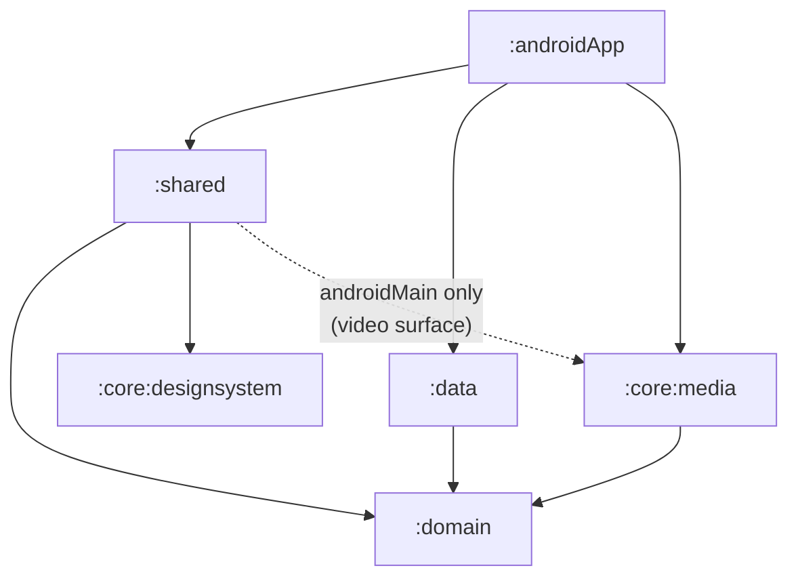

# Streamly

Streamly is a minimal YouTube-style Android app with long-form HLS videos, vertical HLS shorts,
offline downloads, and a profile with sign-out. It is built with Kotlin Multiplatform and Compose
Multiplatform, with an Android target only.

> **Status:** onboarding, a persisted session, the home feed, and the normal-video player are
> done. Returning users go straight to Home, which loads the video catalog with category chips,
> an adaptive grid, and loading, empty, and error states. Tapping a video plays it over HLS with
> Media3: play/pause, scrubbing, mute, a buffering indicator, a LIVE badge for live streams,
> playback errors with retry, and an up-next list. Shorts are the next task.

## Setup

**Requirements**

- Android Studio with the Android SDK for API 37 (`compileSdk`/`targetSdk` 37, `minSdk` 24).
- JDK 17 or newer to start Gradle. The Gradle daemon runs on JDK 21
  (`gradle/gradle-daemon-jvm.properties`); Gradle can provision it automatically.
- A device or emulator running Android 7.0 (API 24) or newer.

**Commands**

```bash
./gradlew :androidApp:assembleDebug     # build the debug APK
./gradlew :androidApp:installDebug      # install on a connected device or emulator
./gradlew check                         # lint and host tests for every module
./gradlew :shared:testAndroidHostTest   # host tests for one module (same task in each library)
```

The debug APK is written to `androidApp/build/outputs/apk/debug/androidApp-debug.apk`.

## Architecture

The app follows clean architecture with MVVM + MVI presentation: each screen has one `ViewModel`
that exposes an immutable `UiState` as a `StateFlow` and accepts a sealed intent type.

### Module graph



| Module | Responsibility |
|---|---|
| `:androidApp` | Thin Android shell: `MainActivity`, `StreamlyApplication`, and the composition root that starts Koin. |
| `:shared` | Compose UI: navigation (Nav3), screen ViewModels, feature screens, and resources. |
| `:domain` | Pure Kotlin models, repository and player contracts, and use cases. Its only dependency is `kotlinx-coroutines-core`. |
| `:data` | Implements the network and session contracts: Ktor clients, DTOs and mappers, and DataStore session storage. |
| `:core:designsystem` | Theme and reusable Compose components. |
| `:core:media` | All Media3 code: the shared normal-video player, the Shorts player pool, `DownloadManager`, and the single download cache that offline playback also reads from. It exposes a Compose video surface to `:shared/androidMain`. |

Dependency rules:

- `:domain` depends on no other module and has no Android, Compose, Ktor, DataStore, Media3, or
  Koin imports.
- Media3 types stay inside `:core:media`. Common UI works with domain state and identifiers, never
  with a Media3 `Player`.
- `:core:media` owns both playback and downloads, so playback and `DownloadManager` share one
  cache. Separate caches would break offline playback.
- Library modules use Kotlin explicit API mode, so every public declaration is a deliberate choice.

### Normal-video playback

One `ExoPlayer` plays every long-form video. The domain declares a framework-free contract,
`VideoPlayer` (`load`, `play`, `pause`, `seekTo`, `setMuted`, `retry`, `stop`), which exposes a
`StateFlow<PlaybackState>`. `:core:media` implements it as `ExoVideoPlayer`, so no Media3 type
reaches the domain or common UI.

**Ownership.** Koin creates `ExoVideoPlayer` as an application singleton in `mediaModule`.
The ViewModel and the composition never own the player, so a rotation cannot recreate it. Every
player screen reuses the same instance, whether the video was opened from Home or from up next.
The `ExoPlayer` inside is built on first use and released only when Koin closes (`onClose`).
It holds the application context only, so it cannot leak an `Activity`.

**Lifecycle.** `PlayerViewModel` drives the player through intents. The screen reports
visibility with `ScreenShown` and `ScreenHidden`:

| What happens | Result |
|---|---|
| The app goes to the background | The video pauses. On return it resumes only if it was playing and the player screen is still showing. A video that finishes loading in the background waits until the screen is shown. |
| Rotation, or a dark-mode switch | Nothing. The screen ignores stop events while the activity is changing configuration. Only the video surface detaches and reattaches; playback continues without rebuffering. |
| Back, or the on-screen back arrow | Nav3 drops the popped entry's lifecycle to `CREATED` at once, so audio pauses before the exit animation (about 40–110 ms on the test devices). When the entry's ViewModel clears, it calls `stop()`, which unloads the video and frees the decoders. The player instance stays. |
| Up next | The current video stops at once, and the new route replaces the old one, so Back returns to Home. |
| Another screen covers the player (no such destination exists yet) | The video pauses, and resumes if the player screen returns. |

The shared player outlives each screen, so a screen controls it only while its own video is
loaded (`PlaybackState.videoId`). A screen that is being replaced can therefore never pause or
stop the video that replaced it. `VideoSurface` follows the same rule: it attaches only while the
player holds its video, and it keeps the screen on only while that video plays.

**HLS and ABR.** Every catalog item is HLS, played through `HlsMediaSource`. The default track
selector and bandwidth meter handle adaptive bitrate. Debug builds attach Media3's
`EventLogger` under the logcat tag `StreamlyPlayer`, so track switches are visible:
`adb logcat -s StreamlyPlayer | grep videoInputFormat`.

**One cache.** `MediaCache` owns the app's only `SimpleCache` (`StandaloneDatabaseProvider`,
`NoOpCacheEvictor`). Playback reads through a `CacheDataSource` over it, so the downloads task
can write into the same cache and downloaded videos will play offline. Playback reads but does
not write, because a cache that never evicts would otherwise grow with everything streamed.

**Adaptive layout.** A phone in portrait shows the 16:9 player above the details and up next.
At expanded widths, up next moves to a side column. A short window, such as a phone in landscape,
shows the video full screen in immersive mode.

### Tech stack

| Concern | Library |
|---|---|
| Language and concurrency | Kotlin 2.4, Coroutines + Flow |
| UI | Compose Multiplatform 1.12, Material 3, Material 3 adaptive (`WindowSizeClass`) |
| Navigation | Navigation 3 with entry-scoped ViewModels |
| Dependency injection | Koin 4.2 |
| Networking | Ktor 3 with kotlinx.serialization; a `MockEngine` serves the catalog API, OkHttp loads images |
| Persistence | DataStore Preferences |
| Media | Media3 1.11: ExoPlayer, HLS, Compose UI, offline downloads |
| Images | Coil 3 with the Ktor network fetcher |
| Testing | `kotlin.test`, `kotlinx-coroutines-test`, Turbine, Ktor `MockEngine`, Compose UI tests |

All versions are pinned in [`gradle/libs.versions.toml`](gradle/libs.versions.toml).

## AI-assisted workflow

The project is built with Claude Code as the agent throughout.

- **One rules file.** [`AGENTS.md`](AGENTS.md) is the only agent configuration. `CLAUDE.md`,
  `.cursor/rules/agents.mdc`, `.codex/instructions.md`, and `.antigravity/rules/agents.md` are
  symlinks to it. Detailed references live in [`docs/agent-reference/`](docs/agent-reference).
- **Small, verified tasks.** Each task has one outcome and its own branch (Gitflow:
  `feature/*` → `develop` → `release/*` → `main`). The agent builds the change, runs the tests,
  and exercises it on a device or emulator before the task counts as done.
- **Human review before every commit.** The agent stages each change and stops. I review the diff
  against the rules files before approving the commit or merge.
- **Visible agent involvement.** Agent-authored commits use Conventional Commits and carry a
  `Co-Authored-By` trailer.
- **Fresh context per task.** At each task boundary the agent writes a self-contained handoff
  prompt for the next task, which starts in a new chat.

## Shortcuts

- **Mocked authentication.** The brief does not require a real auth API. "Continue with Google"
  signs in at once with a fixed demo profile (Anika Rahman, anika@streamly.app). Email sign-in
  asks only for a valid address, with no password, and builds the display name from it
  (`jane.doe@…` becomes "Jane Doe"). The session is stored locally in DataStore.
- **Mocked catalog API.** The repo is private, so there is no hosted JSON to fetch. The video
  catalog is bundled with the app (`BundledCatalog`) and served by `CatalogMockApi`, a Ktor
  `MockEngine` that answers `GET videos`, `videos/{id}`, and `videos/{id}/up-next` after about
  600 ms of simulated latency. Requests still go through the real client pipeline (content
  negotiation, DTOs, mappers, and `safeCall`, which maps failures to `DataError.Network`), so a
  real backend only needs a different engine. `ktor-client-mock` is therefore a production
  dependency of `:data`. Because the catalog is local, the feed also loads offline.
- **Demo metadata over real streams.** Titles, channels, view counts, and dates are made up. Every
  video is a public HLS test stream (Mux, Apple, Shaka, Unified Streaming), including two live
  streams, and every thumbnail is a public image; all were checked to respond when added.
- **Static chips.** All, Music, and Live filter the loaded feed locally rather than querying
  the API. Live matches streams with no fixed duration, so a live music stream appears under both.
- **Player actions are stubs.** Like and Subscribe toggle only for the current screen and are not
  saved. Share shows a "coming soon" message. Download is shown disabled until the downloads
  task; it never shows fake progress.
- **Media segments use Media3's HTTP stack.** The API goes through Ktor, but HLS playlists and
  segments load through Media3's `DefaultHttpDataSource`. Media3 has no Ktor data source, and
  writing one would add risk to the most heavily graded area without changing behavior.

### Known polish gaps

- The launch splash is the default Android one rather than a branded splash.
- Status bar icons are always light, which suits the current brand-colored headers. Screens with
  light headers will need per-screen system bar styling.
- Text uses the default font instead of the rounded display font in the mockups.
- The mockup's two header icons are not shown, because search and the profile entry do not exist
  yet. Profile arrives with the navigation shell.
- A thumbnail that failed to load while offline keeps its placeholder until its card scrolls out
  and back, or the screen is reopened; Coil does not retry when the connection returns.
- The feed's error state is covered by unit tests but cannot be triggered on a device, because
  the bundled catalog never fails.
- On a phone in landscape, the header and chips take a large share of the height. A collapsing
  header would give the grid more room.
- Playback stops when the app is in the background. There is no `MediaSession`, background
  audio, notification, or picture-in-picture.
- Up next does not autoplay when a video ends; the replay button restarts it.
- The live test streams sometimes rebuffer on the emulator. The buffering indicator shows while
  they do.
